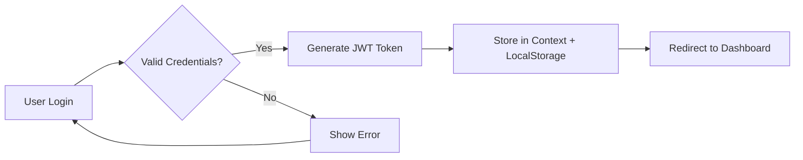

# 🛍️ MicroShop Frontend

<div align="center">


**A production-ready e-commerce platform featuring a modern storefront and comprehensive admin dashboard**

[Features](#-features) • [Tech Stack](#-tech-stack) • [Quick Start](#-quick-start) • [Documentation](#-project-structure) • [Contributing](#-contributing)

</div>

---

## 📋 Overview

MicroShop Frontend is a high-performance e-commerce solution built with modern web technologies. It combines an intuitive customer-facing storefront with a powerful administrative dashboard, delivering seamless shopping experiences and efficient business operations.

**Built for scale** with TypeScript, React 18, and enterprise-grade state management through TanStack Query v5.

---

## ✨ Features

<details open>
<summary><b>🎯 Core Capabilities</b></summary>

### Performance & Architecture
- **Smart Data Fetching**: TanStack Query v5 with automatic caching, background synchronization, and optimistic updates
- **Type Safety**: End-to-end TypeScript implementation ensuring runtime reliability
- **State Management**: Context API for authentication, cart persistence, and theme preferences

### Customer Features
- **Product Discovery**: Advanced filtering, sorting, and search capabilities
- **Shopping Cart**: Real-time updates with persistent storage across sessions
- **Wishlist Management**: Save and organize favorite products
- **User Account**: Profile management, order history, and preference settings

### Admin Dashboard
- **Analytics & Insights**: Interactive charts powered by Recharts for sales tracking and KPI monitoring
- **Product Management**: Complete CRUD operations with image uploads and bulk actions
- **Order Processing**: Real-time order tracking and status management
- **Responsive Tables**: Sortable, filterable data grids for efficient administration

</details>

---

## 🏗️ Tech Stack

| Category | Technologies |
|----------|-------------|
| **Framework** | [React 18](https://react.dev/) with [Vite](https://vitejs.dev/) |
| **Language** | [TypeScript](https://www.typescriptlang.org/) |
| **State Management** | [TanStack Query v5](https://tanstack.com/query/latest) + React Context |
| **Styling** | [Tailwind CSS](https://tailwindcss.com/) |
| **UI Components** | [Shadcn UI](https://ui.shadcn.com/) + [Radix UI](https://www.radix-ui.com/) |
| **Forms** | [React Hook Form](https://react-hook-form.com/) + [Zod](https://zod.dev/) |
| **Charts** | [Recharts](https://recharts.org/) |
| **Icons** | [Lucide React](https://lucide.dev/) |

---

## 🚀 Quick Start

### Prerequisites

Ensure you have the following installed:
- **Node.js** 18.x or higher ([Download](https://nodejs.org/))
- **npm** 9.x or higher (comes with Node.js)

### Installation

```bash
# Clone the repository
git clone https://github.com/rahul-raj1709/microshop-frontend.git
cd microshop-frontend

# Install dependencies
npm install

# Start development server
npm run dev
```

The application will launch at `http://localhost:8080`

### Available Scripts

| Command | Description |
|---------|-------------|
| `npm run dev` | Start development server with hot reload |
| `npm run build` | Create production build |
| `npm run preview` | Preview production build locally |
| `npm run lint` | Run ESLint for code quality checks |

---

## 📂 Project Structure

```text
src/
├── components/
│   ├── dashboard/          # Admin analytics components
│   │   ├── MetricCard.tsx  # KPI display cards
│   │   └── SalesChart.tsx  # Revenue visualizations
│   ├── layout/             # Page layouts and navigation
│   │   ├── CustomerLayout.tsx
│   │   └── AdminLayout.tsx
│   └── ui/                 # Shadcn UI components
│       ├── button.tsx
│       ├── card.tsx
│       └── ...
├── context/                # Global state management
│   ├── AuthContext.tsx     # Authentication state
│   ├── CartContext.tsx     # Shopping cart state
│   └── ThemeContext.tsx    # Theme preferences
├── hooks/                  # Custom React hooks
│   ├── use-toast.ts
│   └── use-products.ts
├── pages/                  # Route components
│   ├── Products.tsx
│   ├── Dashboard.tsx
│   └── ...
├── lib/                    # Utilities and configurations
│   ├── api.ts              # API client setup
│   ├── utils.ts            # Helper functions
│   └── validators.ts       # Zod schemas
└── types/                  # TypeScript definitions
    └── index.ts
```

---

## 🎨 UI Components

MicroShop leverages **Shadcn UI** for a consistent, accessible component library:

- **Forms**: Input, Select, Checkbox, Radio with built-in validation
- **Data Display**: Table, Card, Badge, Avatar
- **Overlays**: Dialog, Sheet, Tooltip, Popover
- **Navigation**: Tabs, Breadcrumb, Pagination
- **Feedback**: Toast, Alert, Progress

All components are fully customizable via Tailwind CSS utilities.

---

## 🔐 Authentication Flow



---

## 🤝 Contributing

Contributions are welcome! Please follow these steps:

1. **Fork** the repository
2. **Create** a feature branch (`git checkout -b feature/amazing-feature`)
3. **Commit** your changes (`git commit -m 'Add amazing feature'`)
4. **Push** to the branch (`git push origin feature/amazing-feature`)
5. **Open** a Pull Request

Please ensure your code:
- Follows the existing TypeScript conventions
- Includes appropriate tests
- Updates documentation as needed

---

## 📄 License

This project is licensed under the **MIT License** - see the [LICENSE](LICENSE) file for details.

---

## 📧 Contact

**Rahul Raj** - [@rahul-raj1709](https://github.com/rahul-raj1709)

Project Link: [https://github.com/rahul-raj1709/microshop-frontend](https://github.com/rahul-raj1709/microshop-frontend)

---

<div align="center">

**⭐ Star this repository if you find it helpful!**

Made with ❤️ using React and TypeScript

</div>
